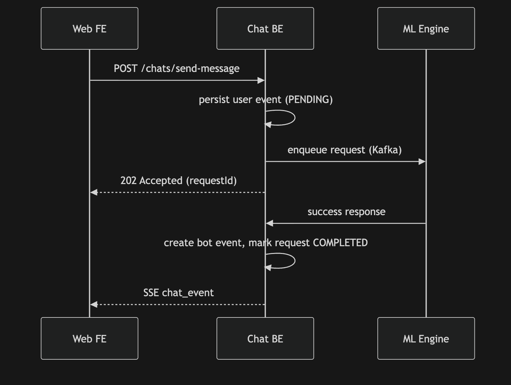
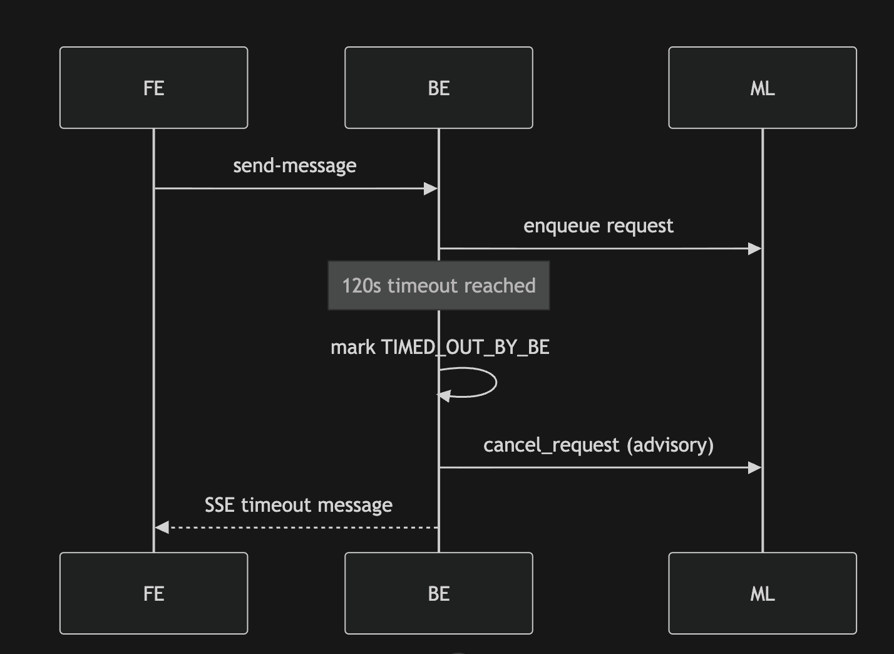
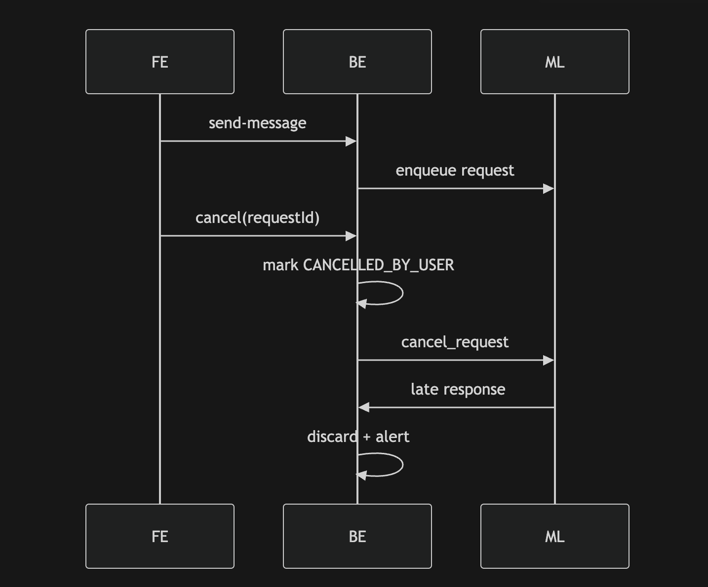
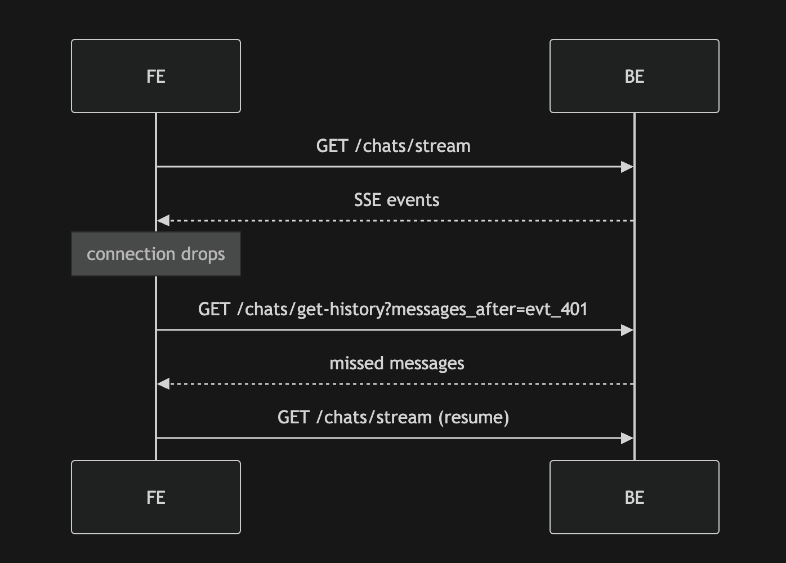

# Chat System Architecture & API Specification  
## **Frozen v1.0**

This document is the **canonical, frozen v1.0 specification** for the Chat system, covering:
- API contracts
- Request lifecycle & state machine
- ML ↔ BE envelopes
- SSE framing & connection rules
- Backend database schemas
- System invariants

This file is intended to be **downloaded, versioned, and committed** as a single source of truth.

---

## 1. Formal Request State Machine

### Lifecycle Diagram (Request-Centric)

```
REQUEST_CREATED
      |
      v
   PENDING
      |
      |-------------------------------|
      |               |               |
      v               v               v
 COMPLETED     ERRORED_AT_ML   TIMED_OUT_BY_BE
                                       |
                                       v
                             (cancel signal to ML)

      |
      v
CANCELLED_BY_USER
(soft delete user event)
```

---

## 2. State Semantics

| State | Meaning |
|------|--------|
| PENDING | Awaiting ML response |
| COMPLETED | ML response processed successfully |
| ERRORED_AT_ML | ML returned explicit error |
| TIMED_OUT_BY_BE | No ML response within BE timeout (120s) |
| CANCELLED_BY_USER | User cancelled request |

---

## 3. Hard Invariants (Request Handling)

- Only **PENDING** requests may accept ML responses
- All other ML responses are **discarded and alerted**
- Cancellation is **advisory** to ML
- Requests never transition out of terminal states
- User request event is soft-deleted only for `CANCELLED_BY_USER`

---

## 4. API Contracts

### 4.1 `GET /chats/get-conversation-id`

Returns the active conversation ID (single chat in Phase 1).

**Response**
```json
{
  "conversationId": "conv_1",
  "isNew": false
}
```

---

### 4.2 `GET /chats/get-chats`

Returns all chats for the user.

```json
{
  "chats": [
    {
      "conversationId": "conv_1",
      "createdAt": "2026-02-06T09:00:00Z",
      "lastActivityAt": "2026-02-06T10:05:00Z"
    }
  ]
}
```

---

### 4.3 `GET /chats/get-history`

**Pagination**
```
/chats/get-history?conversationId=conv_1&page=0&page_size=3
```

**Response**
```json
{
  "conversationId": "conv_1",
  "messages": [
    {
      "eventId": "evt_201",
      "eventType": "message",
      "sender": { "type": "bot", "id": "re_bot" },
      "payload": { ... },
      "createdAt": "2026-02-06T10:00:01Z"
    }
  ],
  "hasMore": true
}
```

**After Event**
```
/chats/get-history?conversationId=conv_1&messages_after=evt_401
```

**Response**
```json
{
  "conversationId": "conv_1",
  "messages": [ { "eventId": "evt_401", "payload": {} } ]
}
```

---

### 4.4 `POST /chats/send-message`

```json
{
  "event": {
    "eventType": "message",
    "sender": { "type": "user" },
    "payload": {
      "messageType": "text",
      "content": { "text": "show me properties" }
    }
  }
}
```

**Response**
```json
{
  "eventId": "evt_301",
  "requestId": "req_901",
  "expectResponse": true,
  "timeoutMs": 15000
}
```

---

### 4.5 `POST /chats/cancel`

```json
{ "requestId": "req_901" }
```

---

### 4.6 `GET /chats/stream` (SSE)

```
GET /chats/stream?conversationId=conv_1
Accept: text/event-stream
```

**Event Format**
```txt
id: evt_401
event: chat_event
data: {JSON_CHAT_EVENT}
```

---

## 5. ML ↔ BE Envelopes

### 5.1 ML Input (BE → ML)

```json
{
  "requestId": "req_123",
  "conversationId": "conv_1",
  "userEventId": "evt_456",
  "event": { "...": "ChatEvent" },
  "expectResponse": true,
  "ttlMs": 120000
}
```

---

### 5.2 ML Success Output

```json
{
  "requestId": "req_123",
  "respondingToEventId": "evt_456",
  "status": "success",
  "event": { "...": "Bot ChatEvent" }
}
```

---

### 5.3 ML Error Output

```json
{
  "requestId": "req_123",
  "respondingToEventId": "evt_456",
  "status": "error",
  "error": {
    "code": "500",
    "message": "Cannot process request"
  }
}
```

---

### 5.4 Cancel Signal (BE → ML)

```json
{
  "type": "cancel_request",
  "requestId": "req_123",
  "reason": "TIMED_OUT_BY_BE"
}
```

---

## 6. SSE Rules

- SSE is **BE → FE only**
- `id` always equals `eventId`
- Ordering strictly by creation time
- Analytics & context events are **never sent**
- FE uses history APIs for replay

---

## 7. Connection Lifecycle Rules

### BE
- Close SSE if:
  - No activity > 15s AND no pending ML
  - No activity > 60s overall

### FE
- Close SSE if no activity > 60s
- Reconnect:
  - Immediately if awaiting ML
  - On-demand otherwise

---

## 8. Backend Database Schemas

### 8.1 `conversations`

```sql
conversation_id VARCHAR PK
user_id VARCHAR
ga_id VARCHAR
created_at TIMESTAMP
updated_at TIMESTAMP
```

---

### 8.2 `chat_events` (Immutable)

```sql
event_id VARCHAR PK
conversation_id VARCHAR
sender_type ENUM('user','bot','system')
event_type ENUM('message','info')
message_type VARCHAR
payload JSONB
source ENUM('FE','ML','SYSTEM')
visibility ENUM('active','soft_deleted')
created_at TIMESTAMP
```

---

### 8.3 `chat_requests` (Mutable)

```sql
request_id VARCHAR PK
conversation_id VARCHAR
user_event_id VARCHAR
state ENUM(
  'PENDING',
  'COMPLETED',
  'ERRORED_AT_ML',
  'TIMED_OUT_BY_BE',
  'CANCELLED_BY_USER'
)
retry_of_request_id VARCHAR
created_at TIMESTAMP
updated_at TIMESTAMP
```

---

## 9. System Invariants (Non-Negotiable)

1. One user message → one request
2. Only PENDING requests accept ML output
3. Event log is append-only
4. Request table is mutable
5. FE never talks to ML
6. ML never talks to FE
7. BE is the single source of truth
8. Late ML responses are discarded and logged

---

## 10. Sequence Diagrams (Non-Negotiable)

### 10.1 User Message → ML → FE (Happy Path)


```
sequenceDiagram
    participant FE as Web FE
    participant BE as Chat BE
    participant ML as ML Engine

    FE->>BE: POST /chats/send-message
    BE->>BE: persist user event (PENDING)
    BE->>ML: enqueue request (Kafka)
    BE-->>FE: 202 Accepted (requestId)

    ML->>BE: success response
    BE->>BE: create bot event, mark request COMPLETED
    BE-->>FE: SSE chat_event
```
---

### 10.2 Timeout at BE (No ML Response)

```
sequenceDiagram
    participant FE
    participant BE
    participant ML

    FE->>BE: send-message
    BE->>ML: enqueue request

    Note over BE: 120s timeout reached
    BE->>BE: mark TIMED_OUT_BY_BE
    BE->>ML: cancel_request (advisory)
    BE-->>FE: SSE timeout message

```
---

### 10.3 Cancel by User

```
sequenceDiagram
    participant FE
    participant BE
    participant ML

    FE->>BE: send-message
    BE->>ML: enqueue request

    FE->>BE: cancel(requestId)
    BE->>BE: mark CANCELLED_BY_USER
    BE->>ML: cancel_request

    ML->>BE: late response
    BE->>BE: discard + alert

```

---

### 10.4 SSE Reconnect Flow

```
sequenceDiagram
    participant FE
    participant BE

    FE->>BE: GET /chats/stream
    BE-->>FE: SSE events

    Note over FE: connection drops

    FE->>BE: GET /chats/get-history?messages_after=evt_401
    BE-->>FE: missed messages

    FE->>BE: GET /chats/stream (resume)

```

---
